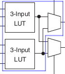
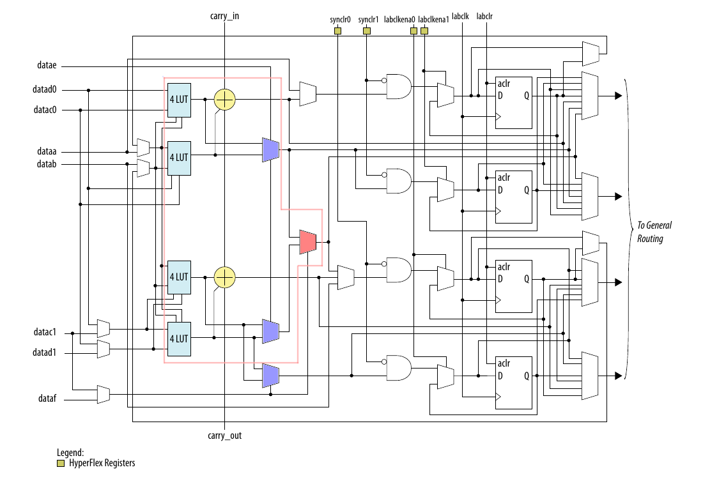

## Cell, BEL and Site Design

One of the key concepts within the FPGA interchange device resources is the
relationship between the cell library and the device BEL and site definitions.
A well designed cell library and a flexible but consise BEL and site
definition is important for exposing the hardware in an efficient way that
enables a place and route tool to succeed.

Good design is hard to capture, but this document will talk about some of the
considerations.

## Granularity of the cell library

It is important to divide the place and route problem and the synthesis
problem, at least as defined for the purpose of the FPGA interchange.  The
synthesis tool operates on the **cell library**, which should be designed to
expose logic elements at a useful level of granularity.

As a concrete example, a LUT4 element is techinically just two LUT3 elements,
connected by a mux (e.g. MUXF4), a LUT3 element is just two LUT2 elements,
connected by a mux (e.g. MUXF3), etc. If the outputs of those interior muxes
are not accessible to the place and route tool, then exposing those interior
function muxes as cells in the cell library is not a useful.

Cell definitions should be granular enough that the synthesis can map to
them, but not so granular that the place and route tool will be making few if
any choices.  If there is only one legal placement of the cell, it's value is
relatively low.

## Drawing site boundries

When designing an FPGA interchange device resource for a new fabric, one
important consideration is where to draw the site boundary.  The primary goal
of lumping BELs within a site is to capture some local congestion due to
fanout limitations.  Interior static routing muxes and output muxes may
accomidate significantly fewer signals than the possible number of BELs that
drive them.  In this case, it is important to draw the site boundary large
enough to capture these cases so as to enable the local congestion to be
resolved during either packing for clustered approaches, or during placement
during unclustered approaches.  In either case, local congestion that is
strongly placement dependant must be resolved prior to general routing,
unless a fused placement and routing algorithm is used.

## Drawing BEL boundaries

BEL definitions require that creating a boundary around primitive elements of
the fabric.  The choice of where to place that boundary has a strong influence
on the design of the cell library in the FPGA interchange.

In general, the smaller the BEL boundary, the more complexity is exposed to
the place and route tool.  In some cases exposing this complexity is
important, because it enables some goal.  For example, leaving static routing
muxes outside of BELs enables a place and route tool to have greater
flexiblity when resolving site congestion.  But as a counter point, if only
a handful of static mux configurations are useful and those choices can be
made at synthesis time, then lumping those muxes into synthesis reduces the
complexity required in the place and route tool.

The most common case where the static routing muxes are typically lumped into
the BEL is BRAM's and FIFO's address and routing configuration.  At synthesis
time, a choice is made about the address and data widths, which are encoded as
parameters on the cell.  The place and route tool does not typically make
meaningful choices on to configuration those static routing muxes, but they
do exist in the hardware.

The most common case where the static routing muxes are almost never lumped
into the BEL is SLICE-type situations.  The remainder of this document will
show examples of why the BEL boundary should typically exclude the static
routing muxes, and leave the choice to the place and route tooling.

### Stratix II and Stratix 10 ALM

Consider both Stratix II and Stratix 10 logic sites.  The first thing to note
is that the architectures at this level are actually mostly the same.  Though
it isn't immediately apparent, both designs are structured around 4 4-LUT
elements.

Take note that of the following structure:

This is actually just two LUT4 elements, where the top select line is
independent.

See the following two figures:

In Stratix 10, the LUT4 element is still present, but the top select line
fracturing was removed.

So now consider the output paths from the the 4 LUT4 elements in the Stratix
II site.  Some of the LUT4 outputs route directly to the carry element, so it
will be important for the place and route tool be able to place a LUT4 or
smaller to access that direct connection.  But if the output is not used in
the carry element, then it can only be accessed in Stratix II via the MUXF5
(blue below) and MUXF6 (red below) elements.

So given the Stratix II site layout, the following BELs will be requires:

 - 4 LUT4 BELs that connect to the carry
 - 2 LUT6 BELs that connect to the output FF or output MUX.

The two LUT6 BELs are shown below:

Drawing a smaller BEL boundary has little value, because a LUT5 element would
still always require routing through the MUXF6 element.

Now consider the Stratix 10 output arrangement.  The LUT4 elements direct to
the carry element is the same, so those BELs would be identical.  The Stratix
10 site now has an output tap directly on the top LUT5, similiar to the Xilinx
Versal LUT6 / LUT5 fracture setup.  See diagram below.  LUT5 element is shown
in blue, and LUT6 element is shown in red.

So given the Stratix 10 site layout, the following BELs will be requires:

 - 4 LUT4 BELs that connect to the carry
 - 2 LUT5 BELs that connect to the output FF or output MUX
 - 1 LUT6 BELs that connect to the output FF or output MUX
